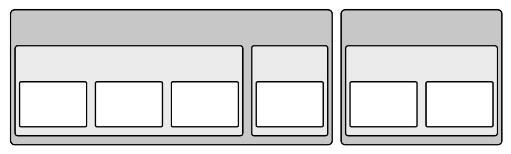
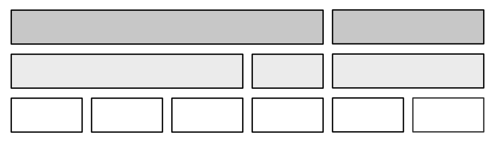
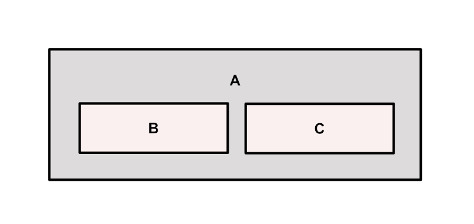
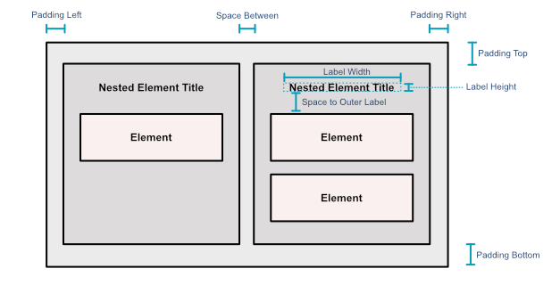

# Smart View Engine

Advanced automatic layout generator for better graph visualization.

## About

This lib was created after observing how hard it can be for some experts to communicate an architecture accurately. Architecture representation and visualization are part of the process of solution design. However, sometimes it is challenging to juggle the discussion of content with the effort it takes to style and organize all elements properly for many audiences. Smart View Engine illuminates this activity by providing views automatically generated from raw architecture models.

## Installation

Using npm:

``
npm i --save @peritoz/smart-view-engine
``

Using Yarn:

``
yarn add @peritoz/smart-view-engine
``

## Getting Started

This lib allows you to easily generate diagrams from a graph description. You can choose from different 
auto-layout styles, such as Nested and Hierarchy layouts.

### Nested Layout

Organizes elements in a top view approach, nesting children inside parents. Best suitable
for tree visualization.



### Hierarchy Layout

Organizes elements in a side view approach, positioning children below parents and respecting 
parents' horizontal boundaries. Best suitable for tree visualization.




### Graph Input

You can pass relationship paths that describe your graph as input to generate advanced views. A relationship path
can be represented as an array of elements, where the most left (first) element is considered the
main element. For example, the following elements form a relationship chain with the main element:

```
(Customer)->(Product)<-(Supplier)
```

The situation presented could be translated as:

```
[Customer, Product, Supplier]
```

For proper rendering, additional information is required when describing
an element in the relationship chain. Elements must be described as follows:

```
{
    identifier: string; // Optional - Represents the element id
    name: string;
    type: string;
}
```

### Generating a View from Paths

Firstly, you must define the paths (graph) to be processed; in this case, a simple example is provided:

```
const paths = [
  [
    {
      "identifier": "2cdb720a",
      "name": "A",
      "type": "businessactor"
    },
    {
      "identifier": "46f5e647",
      "name": "B",
      "type": "businessprocess"
    }
  ],
  [
    {
      "identifier": "2cdb720a",
      "name": "A",
      "type": "businessactor"
    },
    {
      "identifier": "46f5e646",
      "name": "C",
      "type": "businessprocess"
    }
  ]
];
```

Then, create and set up the engine by passing a Settings object.

```
const layoutSettings = new Settings({
    layoutType: "nested", // The chosen layout type is indicated here
    spaceBetween: 2,
    spaceToOuterLabel: 2
});
  
let smartView = new SmartViewEngine(layoutSettings);
```

Finally, generate a View description from your paths.

```
const view = smartView.generateViewFromPaths(paths, "View Name");
```

The result is a View description containing View Nodes and Relationships with
proper Width, Height and Position to be drawn using a drawing tool from your
preference.

The following image shows a sample output rendering for the paths provided in the example mentioned above.



> You can use [archimate-diagram-engine](https://www.npmjs.com/package/@arktect-co/archimate-diagram-engine) to
> render Archimate views using JointJS

### Output

The generated diagram is returned as a View, which is an object containing mainly the View Nodes
and View Relationships. From this object, you can render your diagram using a drawing tool of
your choice.

A View is structured as follows:

```
{
  id: string;
  viewRelationships: [
      {
          name: string;
          type: string;
          parentId: string | null;
          modelNodeId: string;
          viewNodeId: string;
      }
  ];
  viewNodes: [
      {
          modelRelationshipId: string;
          sourceId: string;
          targetId: string;
          viewRelationshipId: string;
          type: string;
          bendpoints: [{ x: number; y: number }];
      }
  ];
  name: string;
  bounds: {
    horizontal: { min: number; max: number };
    vertical: { min: number; max: number };
  };
}
```

### Settings

You can control how the View will be generated by adjusting Settings parameters.

- **layoutType** [LayoutTypes]: Layout option. Currently, can be *nested* or *hierarchy*
- **maxHorizontalCount** [number]: How many elements are allowed on the same row at level 0 (root level)
- **maxChildHorizontalCount** [number]: How many elements are allowed on the same row within the parent scope
- **spaceBetween** [number]: Points between elements
- **spaceToOuterLabel** [number]: Points between the first element and the label area
- **sizeUnit** [number]: Small size unit to be used to build elements. An ordinary element has 3 Size Units (Width) x 1 Size Unit (Height)
- **leftPadding** [number]: Padding between nested elements and the parent's left border
- **rightPadding** [number]: Padding between nested elements and the parent's right border
- **topPadding** [number]: Padding between nested elements and the parent's top border
- **bottomPadding** [number]: Padding between nested elements and the parent's bottom border
- **labelWidth** [number]: Label area width
- **labelHeight** [number]: Label area height
- **lateralLabel** [boolean]: Indicates that the label area must be placed sideways

The image below illustrates how the Settings parameters affect the generated visualization.

