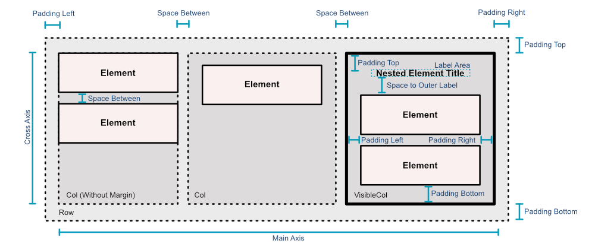
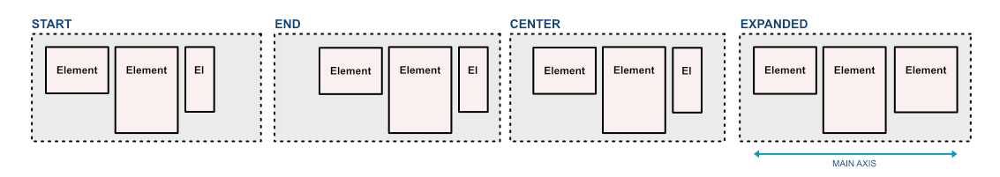
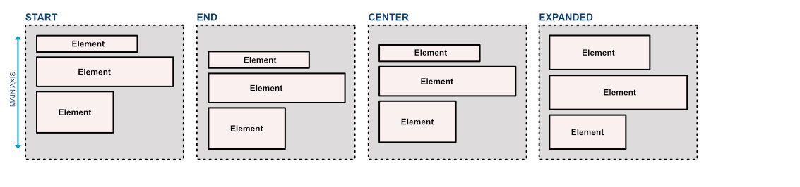
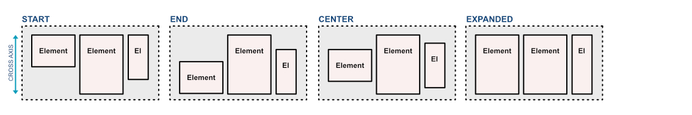
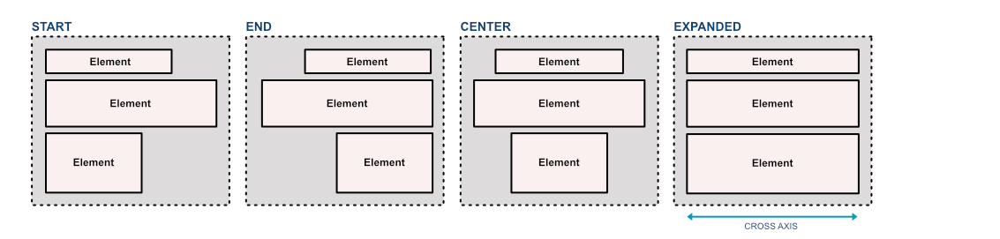
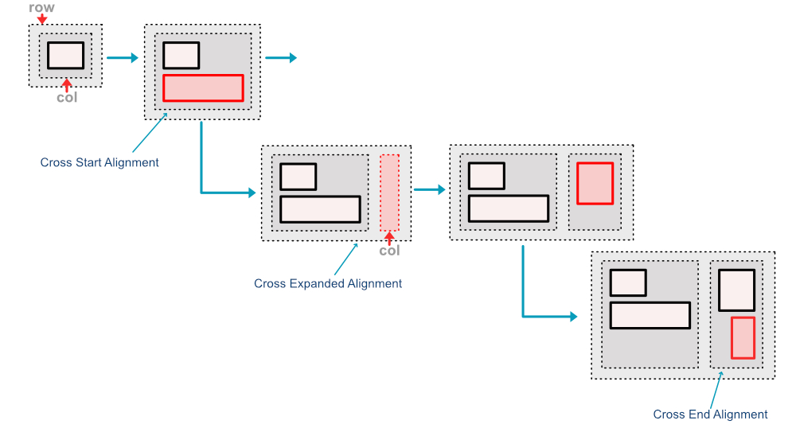
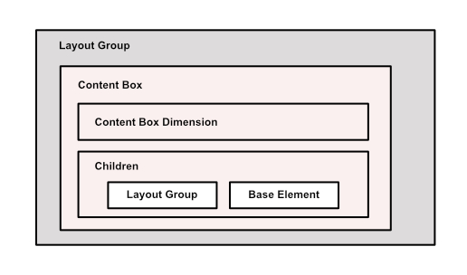

# Smart View Dev Docs

## Motivation

This lib was created after observing how hard it can be for some experts to communicate
an architecture accurately. Architecture representation and visualization are part of the process
of solution design. However, sometimes it is challenging to juggle the discussion of content with the effort
it takes to style and organize all elements properly for many audiences. **Smart View Engine** illuminates
this activity by providing views automatically generated from raw architecture models.

## Goal

> To provide a tool to auto-generate powerful and precise architecture representations for everyone

## The Future

Currently, the **Smart View Engine** only supports generating views following two layout options: Hierarchy and Nested.
In the future, it is planned to release more layout support such as:

- Stack: Elements positioned on top of each other.
- Process: Elements are presented as a sequence of elements. Reading from left to right.
- Tabular: Elements are presented as a table.
- Linked: Elements linked by relationships, presented with an auto-routing feature.

In addition, support for hybrid layouts is also planned, mixing different layout styles to generate views 
of complex architectures.

## Assumptions

- 3 Categories of elements
    - Row or Col: Invisible groups for vertical or horizontal grouping
    - Visible Row or Visible Col: Visible group elements that group other elements vertically or horizontally
    - Base Element: Box element (Leaves)
- All elements have Width and Height
    - Container elements (Row, Col, Visible Row and Visible Col) have content box
        - In visible elements, the content box considers:
            - Label area
            - Label position
            - Padding
        - Invisible elements do not have padding between the edge and the content box
- When inserting an element, its position must be relative, but it must consider padding and other offsets (this causes only changes in size to trigger redistribution)
- When inserting an element the dimensions of the parent element must be adjusted
- When inserting an element, the child elements must be redistributed and realigned
- Groups with *Extended* (alignment option) dimensions only accept children with the same *Extended* dimension
- It must not be possible to arbitrarily specify width or height for children of a group with Extended alignment option. Note that these constraints only applies to the related axis. For example, you can't arbitrarily change the width of a child if the horizontal axis alignment option is *Extended*.
- Groups with *Extended* must be initialized with the maximum size of the axis with *Extended* characteristic (this way, regardless of what happens internally in the group, the size will not change)
- If during the insertion of an element the size of the parent changes, it must be adjusted the size of the parent of the parent, performing redistribution and realignment. If the size of the parent of the parent changes, the algorithm must be applied again recursively

## Project Overview

### Settings

You can control how the View will be generated by adjusting Settings parameters.

- **layoutType** [LayoutTypes]: Layout option. Currently, can be *nested* or *hierarchy*
- **maxHorizontalCount** [number]: How many elements are allowed on the same row at level 0 (root level)
- **maxChildHorizontalCount** [number]: How many elements are allowed on the same row within the parent scope
- **spaceBetween** [number]: Points between elements
- **spaceToOuterLabel** [number]: Points between the first element and the label area
- **sizeUnit** [number]: Small size unit to be used to build elements. An ordinary element has 3 Size Units (Width) x 1 Size Unit (Height)
- **leftPadding** [number]: Padding between nested elements and the parent's left border
- **rightPadding** [number]: Padding between nested elements and the parent's right border
- **topPadding** [number]: Padding between nested elements and the parent's top border
- **bottomPadding** [number]: Padding between nested elements and the parent's bottom border
- **labelWidth** [number]: Label area width
- **labelHeight** [number]: Label area height
- **lateralLabel** [boolean]: Indicates that the label area must be placed sideways

The picture below illustrates how the settings can affect View rendering.

#### Main Axis Alignment Options

New elements are added side by side, horizontally, in a **Row**. Because of this, the horizontal axis on a
**Row** is also called the *main axis*. The following image illustrates how alignment options affect
elements on the *main axis*.

New elements are added below each other, vertically, in a **Column**. Because of this, the vertical axis on a
**Column** is also called the *main axis*. The following image illustrates how alignment options affect
elements on the *main axis*.

#### Cross Axis Alignment Options

While the horizontal axis of a **Row** is called the *main axis*, the vertical axis is called the *cross axis*.
The following image illustrates how alignment options affect elements on the *cross axis*.

While the vertical axis of a **Column** is called the *main axis*, the horizontal axis is called the *cross axis*.
The following image illustrates how alignment options affect elements on the *cross axis*.

#### The Process of Adding a Container

## Main Elements

### Layout Director

### Layout Group

A **Layout Group** groups other elements in a nested manner. Its children can be 
other groups or base elements. A **Layout Group** contains a **Content Box**, which
keeps all of its children. This is illustrated in the image below.

There are four specialized Layout Groups:

- **Layout Row**: Invisible group. Used only for layout composition. Organizes its children horizontally.
- **Layout Col**: Invisible group. Used only for layout composition. Organizes its children vertically.
- **Visible Layout Row**: Visible group (treated as a node when rendering Views). As a Row, groups children horizontally.
- **Visible Layout Col**: Visible group (treated as a node when rendering Views). As a Col, groups children vertically.

### Content Box

The most important layout component. It applies distribution and alignment processing on each container 
insertion. The Content Box is mainly responsible for keeping the dimensions of the box compatible with 
its content. In addition, it contains children in which its dimensions and positions are managed.

### Base Element

A **Base Element** is an element that has no children. In other words, it is the leaf of a Layout Tree. 
**Base Elements** are visible and must be rendered as boxes (rectangles) or another shape that conforms 
to a boxed boundary.